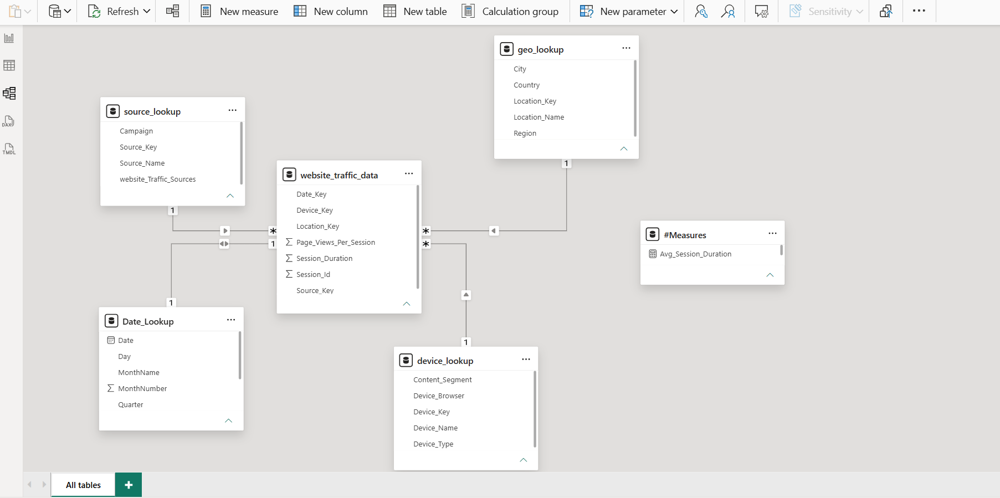

# 📊 Website Traffic Analytics Using Power BI

A Power BI data analytics project using website traffic data to analyze user sessions, page views, session duration, bounce rate, traffic sources, devices, trends, and geographic performance.

The project uses **MySQL as the data source**, **Power Query for data transformation**, and **Power BI for data modeling, DAX calculations, analysis, and dashboard development**.

MySQL queries were also used independently to **cross-check the results produced in Power BI during the development of each report page**.

---

## 📸 Dashboard Preview


---

## 🛠️ Tools Used

- **MySQL** – Data source and result validation
- **Power Query** – Data transformation and preparation
- **Power BI** – Data modeling, analysis, and dashboard development
- **DAX** – Measures and calculations
- **Git** – Version control
- **GitHub** – Project hosting

---

## 🔄 Project Workflow

The project was developed step by step using the following workflow:

```text
MySQL
   ↓
Extract Data
   ↓
Power Query
   ↓
Transform Data
   ↓
Load into Power BI
   ↓
Create Date Table
   ↓
Create Measures Table
   ↓
Create DAX Measures
   ↓
Build Data Model
   ↓
Develop Report Pages
   ↓
Cross-check Results with MySQL
   ↓
Final Dashboard
```

I developed the report one page at a time. While developing each page, I used the corresponding MySQL queries to compare the results with Power BI and check that the calculations were correct.

---

## 🎯 Project Objectives

The main objectives of this project are:

- Analyze overall website traffic and user sessions.
- Compare website activity across different device types.
- Analyze traffic sources and source types.
- Compare session duration and page views across different categories.
- Analyze bounce rate by device, browser, source, and content segment.
- Study traffic and bounce rate trends over time.
- Analyze website performance across regions and cities.
- Identify top cities based on page views, sessions, and session duration.
- Create interactive Power BI dashboards using DAX.
- Validate Power BI results using independent MySQL queries.

---

## 🗃️ Dataset

The project uses an **open website traffic dataset** containing session-level website activity and lookup information.

The main traffic table contains:

- Session ID
- Date
- Source
- Device
- Location
- Session Duration
- Page Views per Session

Lookup tables are used for:

- Device information
- Traffic source information
- Geographic information

The dataset covers the period:

**January 1, 2020 – September 9, 2021**

### Main Tables

```text
website_traffic_data
device_lookup
source_lookup
geo_lookup
```

A separate `Date_Lookup` table was created in Power BI for time-based analysis.

---

## 🧩 Data Model

After transforming the data, I created a structured data model in Power BI.

The model contains:

- `website_traffic_data`
- `device_lookup`
- `source_lookup`
- `geo_lookup`
- `Date_Lookup`
- `#Measures`

A dedicated **Measures table** was created to keep the DAX measures organized.



---

## 📐 DAX & Measures

After creating the data model, I created the required DAX measures for the report.

### Total Number of Sessions

```DAX
Total_Number_Of_Sessions =
COUNT(website_traffic_data[Session_Id])
```

### Total Page Views

```DAX
Total_page_views =
SUM(website_traffic_data[Page_Views_Per_Session])
```

### Total Session Duration

```DAX
Total_Session_Duration =
SUM(website_traffic_data[Session_Duration]) / 3600
```

### Average Session Duration

```DAX
Avg_Session_Duration =
AVERAGE(website_traffic_data[Session_Duration]) / 3600
```

### Bounce Rate

A session is considered a bounce when it has fewer than **2 page views**.

```DAX
Bounce_Rate =
VAR Bounced_Session =
    CALCULATE(
        COUNT(website_traffic_data[Session_Id]),
        website_traffic_data[Page_Views_Per_Session] < 2
    )

VAR output =
    DIVIDE(
        Bounced_Session,
        [Total_Number_Of_Sessions],
        0
    )

RETURN
    output
```

A date table was also created to support monthly, weekly, weekday, and quarterly analysis.

The complete DAX queries are available in:

`website traffic analytics Dax queries.txt`

---

## 🔍 SQL Validation & Cross-Checking

MySQL was used as both the **source of the data** and an **independent validation layer**.

The SQL queries were not the main implementation of the Power BI visuals. I used them alongside the Power BI development process to check whether the DAX calculations and visual results were matching the expected results.

### Validation Covered

#### Devices & Sources

- Session duration by device
- Average session duration by device
- Page views by device
- Bounce rate by device
- Bounce rate by browser
- Session duration by traffic source
- Average session duration by traffic source
- Page views by traffic source
- Bounce rate by traffic source
- Bounce rate by content segment

#### Trends

- Session duration trends
- Monthly bounce rate
- Daily/weekday bounce rate
- Quarterly session duration
- Quarterly page views
- Quarterly bounce rate

#### Geography

- Regionwise page views
- Regionwise session duration
- Regionwise bounce rate
- Top 5 cities by page views
- Top 5 cities by session duration
- Top 5 cities by sessions
- Top 5 cities by bounce rate

#### Dashboard KPI Validation

- Total sessions
- Total page views
- Total session duration
- Average session duration
- Overall bounce rate

The SQL queries are available in:

`webtraffic_Mysql_Queries.sql`

---

# 📊 Dashboard Pages

## 1. Website Traffic by Devices & Sources

This page focuses on website activity across different devices and traffic sources.

The analysis includes:

- Total Session Duration
- Average Session Duration
- Total Page Views
- Bounce Rate by Content Segment
- Bounce Rate by Device Browser
- Bounce Rate by Traffic Source
- Bounce Rate by Device Type


---

## 2. Website Traffic Trends

The Trends page focuses on how website activity changes over time.

It includes:

- Monthly Bounce Rate
- Daily Bounce Rate
- Session Duration by Traffic Source
- Session Duration by Device Type
- Overall Average Session Duration Trend


Small multiple charts are used for traffic sources and device types so that individual trends can be compared more clearly.

---

## 3. Website Traffic by Geography

The Geography page focuses on regional and city-level website performance.

### Regionwise Analysis

- Total Page Views by Region
- Total Session Duration by Region
- Bounce Rate by Region

### Top 5 City Analysis

- Top 5 Cities by Total Page Views
- Top 5 Cities by Total Session Duration
- Top 5 Cities by Total Number of Sessions

The page also includes city-level tooltip pages for additional information.

---

## 4. City-Level Tooltips

Four tooltip pages were created to provide additional city-level information without adding more visuals to the main report pages.

The tooltip pages cover:

- Total Session Duration by City
- Total Page Views by City
- Total Number of Sessions by City
- Bounce Rate by City

---

## 5. Summary Dashboard

The Summary page brings the main KPIs and important analysis together in one place.

It includes filters for:

- Device Type
- Source Type
- Campaign Type

The page also contains:

- Regionwise analysis
- Bounce rate by traffic source
- Bounce rate by device type
- Traffic trends

---

## 📈 Key Metrics

The completed report contains the following overall metrics:

| Metric | Value |
|---|---:|
| Total Sessions | **731** |
| Total Page Views | **2,522** |
| Total Session Duration | **135.68 Hours** |
| Average Session Duration | **0.19 Hours** |
| Bounce Rate | **9.58%** |

---

## 📂 Project Files

### `Datasets/`

Contains the CSV files used in the project.

### `Screenshots/`

Contains screenshots of the Power BI report and data model.

### `website_traffic_analytics_icons/`

Contains the icons and image assets used in the dashboard.

### `Website_Traffic.pbix`

The Power BI report containing the data model, DAX measures, visuals, report pages, navigation, and tooltip pages.

### `Website_Traffic_Dashboard_Documentation.docx`

Detailed documentation covering the report pages, visual configuration, formatting, navigation, tooltip setup, and other Power BI implementation details.

### `website traffic analytics Dax queries.txt`

Contains the DAX calculations used in the Power BI report.

### `webtraffic_Mysql_Queries.sql`

Contains the MySQL queries used for analysis and independent validation of the Power BI results.

---

## 🧠 What This Project Demonstrates

This project gave me practical experience in working through a complete BI workflow:

**Extract → Transform → Model → Calculate → Visualize → Validate**

It helped me practice:

- SQL
- Power Query
- Data modeling
- DAX
- KPI creation
- Time-based analysis
- Geographic analysis
- Dashboard development
- Data validation
- Git and GitHub

---

## 📌 Note

> **This project was developed for learning and portfolio purposes. It uses an openly available data source and is intended to demonstrate my practical experience with SQL, Power Query, Power BI, DAX, data modeling, dashboard development, and result validation.**

---

## 👨‍💻 Author

**Eswar**

Data Analytics Portfolio Project
